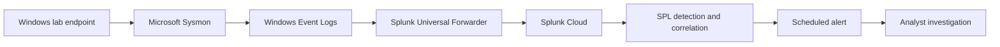

# PowerShell Threat Detection and Investigation Using Sysmon & Splunk Cloud

## Overview

This project demonstrates an end-to-end Security Operations Center (SOC) workflow for detecting and investigating suspicious PowerShell activity. Microsoft Sysmon supplied endpoint telemetry, Splunk Universal Forwarder sent the events to Splunk Cloud, and SPL was used to correlate activity and create a scheduled alert.

The controlled test produced process creation, file creation, and outbound network activity from one PowerShell process. The events were correlated using Sysmon `ProcessGuid`. A behavioural detection then identified suspicious PowerShell command-line patterns and enriched each result with a reason, severity, and analyst context.

The scheduled alert matched one event and successfully sent an email notification, completing the workflow from endpoint telemetry to analyst notification.

## Architecture



## Technologies

- Microsoft Sysmon
- Windows Event Logs
- Splunk Universal Forwarder
- Splunk Cloud
- Search Processing Language (SPL)
- PowerShell
- MITRE ATT&CK

## Controlled Test Scenario

An authorised PowerShell test was executed in the lab. The process:

1. launched PowerShell;
2. created `sysmon-test.txt`; and
3. made an outbound web request.

The exercise intentionally generated defensive test telemetry. It was not a real compromise.

## Event Correlation

The investigation focused on:

| Sysmon event | Activity | Investigative value |
|---|---|---|
| Event ID 1 | Process creation | Identified the PowerShell command line, user, and parent process |
| Event ID 11 | File creation | Recorded creation of the lab test file |
| Event ID 3 | Network connection | Recorded outbound activity from PowerShell |

All three events shared the same `ProcessGuid`, attributing the process, file, and network activity to one execution chain:

```text
Event ID 1  -> PowerShell process created
Event ID 11 -> File created by that process
Event ID 3  -> Outbound connection made by that process
```

The reusable correlation search is available in [`detections/processguid-correlation.spl`](detections/processguid-correlation.spl).

## Detection Engineering

The behavioural detection identifies PowerShell process creation containing command-line patterns such as:

- `Invoke-WebRequest`
- `DownloadString`
- `EncodedCommand`
- `-enc`

It enriches matching events with:

- `DetectionReason`
- `Severity`
- `ParentImage`
- `User`
- `AnalystContext`
- `CommandLine`

The detection is in [`detections/suspicious-powershell.spl`](detections/suspicious-powershell.spl).

> The lab query uses `index=*` for portability. In production, replace it with the dedicated Windows/Sysmon index and tune the patterns against approved administrative activity.

## False-Positive Analysis

A behavioural match is a lead, not proof of compromise. Legitimate administration, software automation, and authorised testing can all launch PowerShell with web or encoded-command functionality.

The analyst should validate:

- process ancestry and parent process;
- full command line and user context;
- network destination and reputation;
- files created or modified;
- prevalence on the endpoint and across the environment; and
- whether the activity is expected and authorised.

## MITRE ATT&CK Mapping

The evidence directly supports:

- **T1059.001 — Command and Scripting Interpreter: PowerShell**

Additional techniques were not assigned because the controlled web request alone did not prove payload delivery or command and control.

## Alerting and Disposition

The final search was saved as a scheduled Splunk alert. It successfully matched suspicious encoded PowerShell behaviour and generated an email notification.

The activity was confirmed as an authorised SOC laboratory simulation. No containment was required.

## Repository Structure

```text
.
|-- README.md
|-- incident-report.md
|-- detections/
|   |-- processguid-correlation.spl
|   `-- suspicious-powershell.spl
|-- evidence/
|   `-- README.md
`-- docs/
    |-- README.md
    `-- redaction-checklist.md
```

Sanitised screenshots and the Splunk alert export can be added to `evidence/` and `docs/` after completing the redaction checklist. They are intentionally not included until they have been reviewed for credentials, email addresses, instance URLs, account names, and other identifiers.

## Skills Demonstrated

- Endpoint telemetry collection
- SIEM onboarding and search
- SPL detection engineering
- Sysmon event correlation
- Process-tree and command-line analysis
- False-positive analysis
- MITRE ATT&CK mapping
- Alert development
- Incident documentation

## Key Lessons

- Collection policy directly determines analyst visibility.
- `ProcessGuid` can tie multiple Sysmon event types to one process execution.
- Behavioural detections are more reusable than searches for a lab-specific string.
- A detection must be validated before it is treated as an incident.
